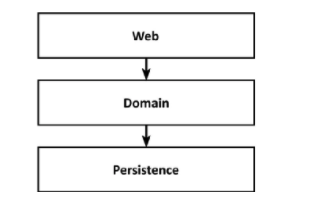
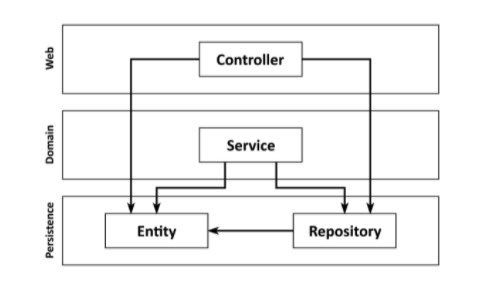
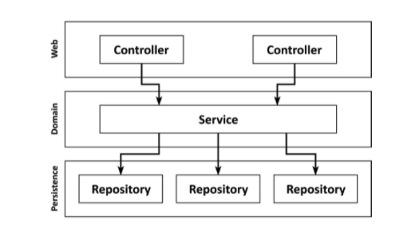

# Get Your Hands Dirty on Clean Architecture

> https://learning.oreilly.com/library/view/get-your-hands/9781839211966/
>
> 스터디
>
> 2021.08.11

## Chapter 1 - What's Wrong With Layers?

레이어는 견고한 아키텍처 패턴이다. 올바르게 이해한다면 웹 및 persistence 계층과 독립적인 도메인 로직를 구축할 수 있다. 원하는 경우 도메인 로직에 영향을 주지 않고 웹 또는 persistence 기술을 전환할 수 있다. 기존 기능에 영향을 주지 않고 새로운 기능을 추가할 수 있습니다.

좋은 계층 구조를 통해 우리는 변화하는 요구 사항과 외부 요인에 빠르게 적응할 수 있다.

그렇다면 레이어 아키텍처에 무슨 문제가 있을까?

계층화된 아키텍처는 너무 많은 열린 측면을 가지고 있다. 나쁜 습관이 침투하여 시간이 지남에 따라 소프트웨어를 변경하기가 점점 더 어려워진다. 아래에 이유가 있다.

### 데이터베이스 기반 설계를 촉진한다

기존의 레이어 아키텍처의 기초는 데이터베이스이다.

모든 것이 persistence 계층 위에 구축된다. 이것은 여러 가지 이유로 인해 문제가 됩다.

대부분의 경우 데이터베이스 구조가 어떻게 생겼는지 생각하고 그 위에 도메인 논리를 구현하는 것으로 넘어간다.

이것은 종속성의 자연스러운 흐름을 따르기 때문에 기존의 계층 구조에서 의미가 있다.

**그러나 비즈니스 관점에서는 전혀 의미가 없다.** 다른 작업을 수행하기 전에 도메인 로직를 설계해야 한다. 그래야만 제대로 이해했는지 알 수 있다. 그리고 올바른 도메인 로직을 구축하고 있다는 것을 알게 된 후에야 이를 중심으로 persistence 및 웹 레이어를 구축해야 한다.

도메인 계층에서 데이터베이스 엔터티를 사용하면 지속성 계층과 강력한 결합이 이루어진다.

일반적으로 위의 그림과 같이 persistence 계층의 일부로 ORM 엔터티가 있다. 계층은 그 아래의 계층에 액세스할 수 있으므로 도메인 계층은 해당 엔터티에 접근할 수 있다.

**이것은 persistence 계층과 도메인 계층 사이에 강력한 결합을 생성한다. 우리 서비스는 persistence 모델을 비즈니스 모델로 사용하며 도메인 논리뿐만 아니라 eager vs lazy loading, 데이터베이스 트랜잭션, 캐시 플러시 및 유사한 하우스키핑 작업도 처리해야 한다.**

**persistence 코드는 사실상 도메인 코드에 결합되어 있기 때문에 변경하기가 어렵다.** 이는 우리 아키텍처의 목표가 되어야 하는 유연하고 옵션을 열어두는 것과는 반대이다.

### 바로 가기가 쉽다(레이어 경계가 흐려진다)

기존의 계층 구조에서 유일한 전역 규칙은 특정 계층에서 동일한 계층 또는 그 아래 계층의 구성 요소에만 액세스할 수 있다는 것이다.

따라서 상위 계층의 특정 구성 요소에 액세스해야 하는 경우 해당 구성 요소를 한 계층 아래로 푸시하면 액세스할 수 있다.

persistence 계층의 모든 항목에 액세스할 수 있으므로 시간이 지남에 따라 뚱뚱해지는 경향이 있다.

Helper 또는 Util 요소는 특정 계층에 속하지 않으므로 최하위 계층으로 밀어 내려서 접근하다 보면 점점 뚱뚱해진다.

**이러한 현상으로 레이어 경계가 점점 흐려진다.**

### 테스트가 어려워 진다

계층화된 아키텍처 내에서 일반적인 발전은 계층을 건너뛰는 것이다. 우리는 Entity의 단일 필드만 조작하기 때문에 웹 레이어에서 직접 Persistence 레이어에 액세스하고 도메인 레이어를 귀찮게 할 필요가 없다.

그러나, **도메인 계층을 건너뛰면 코드 기반 전체에 도메인 로직이 분산되는 경향이 있다.**

처음 몇 번은 괜찮게 느껴지지만 자주 발생하면 두 가지 단점이 있다.

첫째, 단일 필드만 조작하는 경우에도 웹 계층에서 도메인 로직을 구현한다. 앞으로 유스케이스가 확장된다면? 우리는 웹 계층에 더 많은 도메인 로직을 추가하여 책임을 혼합하고 애플리케이션 전체에 필수적인 도메인 로직를 퍼뜨린다.

둘째, 웹 계층 테스트에서 도메인 계층뿐만 아니라 persistence 계층도 mocking해야 한다. 이것은 단위 테스트에 복잡성을 추가한다.

웹 구성요소는 시간이 지남에 따라 증가하므로 서로 다른 persistence 구성요소에 대한 의존도가 높아져 테스트의 복잡성이 가중될 수 있다. 어느 순간, 우리가 의존성을 이해하고 mocking 하는데 실제로 서비스 코드를 작성하는 것보다 더 많은 시간이 소요된다. 

### Use Case를 숨긴다

우리는 일반적으로 새 코드를 만드는 것보다 기존 코드를 변경하는 데 훨씬 더 많은 시간을 보낸다.

기능을 추가하거나 변경할 적절한 위치를 자주 찾기 때문에 아키텍처는 코드 기반을 빠르게 탐색하는 데 도움이 된다. 이와 관련하여 계층화된 아키텍처는 어떻게 유지되고 있을까?

계층화된 아키텍처에서 도메인 로직이 계층 전체에 쉽게 분산될 수 있다. 계층을 건너뛰는 접근이 많아진다. 그리고 도메인과 지속성 계층 모두에서 액세스할 수 있도록 특정 구성 요소들이 최하위 계층에 존재할 수 있다. 이것은 새로운 기능을 추가할 적절한 위치를 찾는 것을 어렵게 만든다.

계층 구조는 도메인 서비스의 "폭"에 대한 규칙을 부과하지 않는다. 시간이 지남에 따라 위의 그림과 같이 여러 사용 사례를 지원하는 매우 광범위한 서비스로 이어지는 경우가 많다.

광범위한 서비스는 persistence 계층에 대한 많은 종속성을 가지며 웹 계층의 많은 구성 요소가 persistence 계층에 의존한다. 이것은 서비스를 테스트하기 어렵게 만들 뿐만 아니라 우리가 작업하려는 사용 사례를 담당하는 서비스를 찾기 어렵게 만든다.

각각 단일 사용 사례를 제공하는 고도로 전문화된 좁은 도메인 서비스가 있다면 얼마나 쉬울까? UserService에서 사용자 등록 사용 사례를 검색하는 대신 RegisterUserService를 열고 작업을 시작하면 된다.

### 동시에 개발하기 어려워진다

소프트웨어 개발자로서 내 경력에서 "완료된" 소프트웨어를 본 적이 없다는 사실을 제외하고, 특정 날짜까지 완료된다는 것은 일반적으로 우리가 병렬로 작업해야 함을 의미한다.

이러한 기대를 충족하려면 아키텍처가 병렬 작업을 지원해야 합니다. 그리고 계층화된 아키텍처는 여기에서 우리에게 실제로 도움이 되지 않는다.

애플리케이션에 새로운 사용 사례를 추가한다고 상상해보자. 세 명의 개발자가 있다. 한명은 필요한 기능을 웹 레이어에 추가하고, 한명은 도메인 레이어, 한명은 persistence 레이어에 기능을 추가할 수 있다.

일반적으로 계층 구조에서는 병렬로 작업하기 힘들다. 모든 것이 persistence 레이어 위에 구축되기 때문에 persistence 레이어가 먼저 개발되어야 한다. 그런 다음 도메인 계층이 오고 마지막으로 웹 계층이 온다. 따라서 한 명의 개발자만 동시에 기능에 대해 작업할 수 있다.

개발자가 먼저 인터페이스를 정의하면 각 개발자가 실제 구현을 기다릴 필요 없이 이러한 인터페이스에 대해 작업할 수도 있다.

물론 이마저도 persistence 레이어와 도메인 로직이 결합되어있지 않은 경우(데이터베이스 중심으로 설계를 하지 않은 경우)에만 가능하다.

코드베이스에 광범위한 서비스가 있는 경우 다른 기능을 병렬로 작업하는 것이 어려울 수도 있다. 동일한 서비스가 병렬로 편집되어 병합 충돌이 발생한다.

### 유지 보수 가능한 소프트웨어를 구축하는 데 어떤 도움이 될까?

위에 언급한 주제들은 계층화된 아키텍처가 많은 것들이 잘못될 수 있음을 보여준다.  
매우 엄격한 자기 훈련이 없으면 시간이 지남에 따라 성능이 저하되고 유지 보수가 어려워지기 쉽다.  
그리고 이러한 자기 훈련은 일반적으로 관리자가 개발 팀에 대해 새로운 마감일을 정할 때마다 덜 엄격해진다.

계층화된 아키텍처의 함정을 염두에 두는 것은  
다음 번에 우리가 지름길을 택하는 것에 반대하고  
계층화된 아키텍처든 다른 아키텍처 스타일이든 대신 유지 관리 가능한 솔루션을 구축하는 데 도움이 될 것이다.

