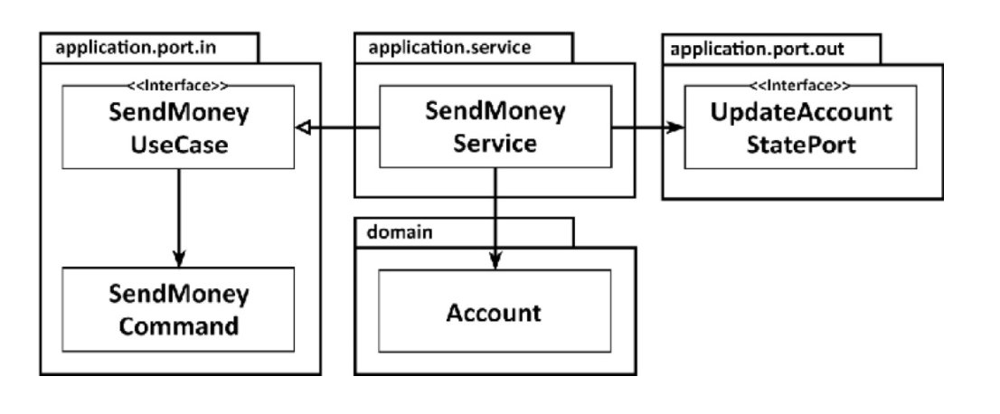

# Get Your Hands Dirty on Clean Architecture

> https://learning.oreilly.com/library/view/get-your-hands/9781839211966/
>
> 스터디
>
> 2021.08.18

## Chapter 4 - Implementing a Use Case

애플리케이션, 웹 및 persistence 계층이 아키텍처에서 느슨하게 결합되어 있으므로 적합한 도메인 코드를 완전히 자유롭게 모델링할 수 있다. 우리는 DDD를 할 수도 있고, 풍부하거나 빈약한 도메인 모델을 구현할 수도 있고, 우리만의 방식을 발명할 수도 있다.

이전 장에서 소개한 육각형 아키텍처 스타일 내에서 사용 사례를 구현하는 독창적인 방법을 설명한다.

도메인 중심 아키텍처에 적합하므로 도메인 엔터티로 시작한 다음 이를 중심으로 Use Case를 구축한다.

### Implementing the domain model

한 계정에서 다른 계정으로 돈을 보내는 사용 사례를 구현하려고 한다.

이것을 객체 지향 방식으로 모델링하는 한 가지 방법은 Account에서 돈을 인출하고 대상 계정에 입금할 수 있도록 돈을 인출 및 입금할 수 있는 **Account** 엔터티를 만드는 것입니다.

```java
package buckpal.domain;

public class Account {
  private AccountId id;
  private Money baselineBalance;
  private ActivityWindow activityWindow;
  
  // constructors and getters omitted
  
  public Money calculateBalance() {
    return money.add(
    	  this.baselineBalance,
        this.activityWindow.calculateBalance(this.id)
    );
  }
  
  public boolean withdraw(Money money, AccountId targetAccountId) {
    if (!mayWithdraw(money)) {
      return false;
    }
    
    Activity withdrawal = new Activity(
        this.id,
        this.id,
        targetAccountId,
        LocalDateTime.now(),
        money
    );
    
    this.activityWindow.addActivity(withdrawal);
    
    return true;
  }
  
  privatge boolean mayWithdraw(Money money) {
    return money.add(
        this.calculateBalance(),
        money.negate()
    ).isPositive();
  }
  
  public boolean deposit(Money money, AccountId sourceAccountId) {
    Activity deposit = new Activity(
        this.id,
        sourceAccountId,
        this.id,
        LocalDateTime.now(),
        money
    );
    
    this.activityWindow.addActivity(deposit);
    
    return true;
  }
}
```

Account 엔터티는 실제 계정의 현재 스냅샷을 제공한다.  
계정에서 모든 출금 및 입금은 ActivityWindow 엔터티에 기록된다. 계정의 모든 활동을 항상 메모리에 로드하는 것은 현명하지 않기 때문에 Account 엔터티는 ActivityWindow 값 객체에 기록된 최근 며칠 또는 몇 주의 활동 창만 보유한다.

현재 Account의 잔액을 계속 계산할 수 있도록 Account 엔터티에는 활동 창의 첫 번째 활동 직전 계정의 잔액을 나타내는 baselineBalance 속성이 추가로 있다. 총 잔액은 baselineBalance에 activityWindow에 있는 모든 활동의 잔액을 더한 것이다.

이 모델을 사용하면 계정에서 돈을 출금하고 입금하는 것은 withdraw() 및 deposit() 메서드에서 수행되는 것처럼 활동 창에 새 활동을 추가하는 문제이다. 인출하기 전에 보유 금액을 초과 인출할 수 없다는 비즈니스 규칙을 확인한다.

이제 돈을 인출하고 입금할 수 있는 Account 엔터티가 있으므로 바깥쪽으로 이동하여 이를 중심으로 사용 사례를 구축할 수 있다.

### A Use Case in a Nutshell

사용사례가 실제로 무엇을 하는지 보자. 일반적으로 다음 단계를 따른다

- 입력을 받는다
- 비즈니스 규칙을 검증한다
- 모델 상태를 조작한다
- 출력을 반환한다

Use Case는 incoming adapter에서 입력을 받는다. 이 단계를 'Validate Input'으로 부르지 않은 이유는 Use Case 코드가 도메인 로직에 관심을 가져야 하고 Input 유효성 검사로 이를 오염시켜서는 안된다고 생각하기 때문이다. Input 유효성 검사는 다른 곳에서 수행하게 된다.

그러나 Use Case는 비즈니스 규칙을 검증할 책임이 있다. Domain 엔티티와 이 책임을 공유한다. 이 장의 뒷부분에서 Input 유효성 검사와 비즈니스 규칙 유효성 검사의 차이점에 대해 알아 본다.

비즈니스 규칙이 충족되면 Use Case는 입력을 기반으로 어떤 방식으로든 모델의 상태를 조작한다. 일반적으로 Domain 객체의 상태를 변경하고, 새로운 상태를 persistence 어탭터에 의해 구현된 포트에 전달하여 영속화 한다. Use Case는 다른 outgoing 어댑터를 사용할 수도 있다.

마지막 단계는 outgoing 어댑터의 반환값을 출력 객체로 변환하는 것이다.

이러한 단계를 염두에 두고 "송금" Use Case 구현을 살펴보자

1장. What's Wrong with Layers?에서 논의된 광범위한 서비스의 문제를 피하기 위해 모든 Use Case를 단일 서비스 클래스에 넣는 대신 각 Use Case에 대해 별도의 서비스 클래스를 만든다.

```java
@RequiredArgsConstructor
@Transactional
public class SendMoneyService implements SendMoneyUseCase {
  private final LoadAccountPort loadAccountPort;
  private final AccountLock accountLock;
  private final UpdateAccountStatePort updateAccountStatePort;
  
  @Override
  public boolean sendMoney(SendMoneyCommand command) {
    // TODO: valudate business rules
    // TODO: manipulate model state
    // TODO: return output
  }
}
```

이 서비스는 incoming 포트 인터페이스인 SendMoneyUseCase를 구현하고,  
outgoing 포트 인터페이스인 LoadAccountPort를 호출하여 Account을 로드하고,  
UpdateAccountStatePort를 호출하여 데이터베이스에 업데이트된 Account 상태를 유지한다.  

다음 그림은 관련 구성요소에 대한 overview이다.



