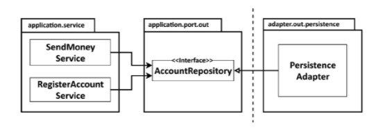
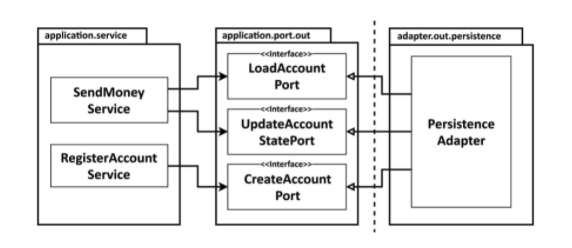
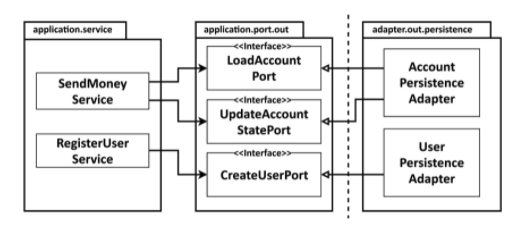
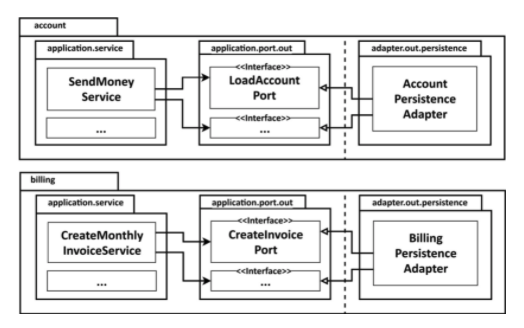

# Get Your Hands Dirty on Clean Architecture

> https://learning.oreilly.com/library/view/get-your-hands/9781839211966/
>
> 스터디
>
> 2021.08.25

## Chapter 6 - Implementing a Persistence Adapter 

1장 '레이어의 문제점은 무엇인가?'에서 나는 결국 모든 것이 Persistence 레이어에 의존하기 때문에 "데이터베이스 중심 설계"를 지원한다고 주장했다. 이 장에서는 이 종속성을 반전시키기 위해 persistence 계층을 응용 프로그램 계층에 플러그인으로 만드는 방법을 살펴본다.

### Dependency Inversion

persistence 계층 대신 애플리케이션 서비스에 persistence 기능을 제공하는 persistence 어댑터에 대해 설명한다.

다음 그림은 Dependency Inversion Principle을 적용하여 이를 수행하는 방법을 보여준다.


코어의 서비스는 포트를 사용하여 persistence 어댑터에 접근한다.

우리의 애플리케이션 서비스는 persistence 기능에 액세스하기 위해 포트 인터페이스를 호출한다.
이러한 포트는 실제 persistence 작업을 수행하고 데이터베이스와 통신하는 persistence 어댑터 클래스에 의해 구현된다.

육각형 아키텍처 용어에서 persistence 어댑터는 "driven" 또는 "outgoing" 어댑터이다.
애플리케이션에서는 이 어댑터를 호출하지만 그 반대로는 호출하지 않기 때문이다.

포트는 사실상 애플리케이션 서비스와 persistence 코드 사이의 간접 계층이다.
**persistence 계층에 대한 코드 종속성 없이 도메인 코드를 발전시킬 수 있도록 이 간접 계층을 추가하고 있음을 기억하자다.** 
persistence 코드를 리팩토링한다고 해서 반드시 코어의 코드가 변경되는 것은 아니다.

기본적으로 런타임에도 애플리케이션 코어에서 persistence 어댑터까지 종속성이 있다.
예를 들어 persistence 계층에서 코드를 수정하고 버그를 만들면 애플리케이션 코어의 기능이 중단될 수 있다.
그러나 포트가 역할을 하는 한 코어에 영향을 주지 않고 persistence 어댑터에서 원하는 대로 자유롭게 할 수 있다.

### The Responsibilities of a Persistence Adapter

persistence 어댑터가 일반적으로 수행하는 작업을 살펴보자.

- 입력을 받는다
- 입력을 데이터베이스 형식으로 매핑
- 데이터베이스에 입력을 저장
- 데이터베이스 출력을 애플리케이션 형식으로 매핑
- 출력을 반환

persistence 어댑터는 포트 인터페이스를 통해 입력을 받는다. 입력 모델은 인터페이스에 지정된 대로 도메인 엔터티 또는 특정 데이터베이스 작업 전용 객체일 수 있다.

그런 다음 입력 모델을 데이터베이스를 수정하거나 쿼리하는 데 사용할 수 있는 형식으로 매핑한다. 
Java 프로젝트에서 우리는 일반적으로 JPA(Java Persistence API)를 사용하여 데이터베이스와 통신하므로 데이터베이스 테이블의 구조를 반영하는 JPA 엔터티 개체에 입력을 매핑할 수 있다.
컨텍스트에 따라 입력 모델을 JPA 엔터티에 매핑하는 것은 거의 이득이 되지 않을 수 있으므로 매핑이 없는 전략에 대해서는 8장, 경계 간 매핑에서 설명한다.

JPA나 다른 객체 관계형 매핑 프레임워크를 사용하는 대신 다른 기술을 사용하여 데이터베이스와 통신할 수 있다. 
입력 모델을 일반 SQL 문에 매핑하고 이러한 명령문을 데이터베이스로 보내거나 들어오는 데이터를 파일로 직렬화하고 거기에서 다시 읽을 수 있다.

**중요한 부분은 persistence 어댑터에 대한 입력 모델이 persistence 어댑터 자체가 아니라 애플리케이션 코어 내에 있으므로 persistence 어댑터의 변경 사항이 코어에 영향을 미치지 않는다는 것이다.**

다음으로 persistence 어댑터는 데이터베이스를 쿼리하고 쿼리 결과를 수신한다.

마지막으로 데이터베이스 응답을 포트에서 예상하는 출력 모델에 매핑하고 반환한다.
다시 말하지만, 출력 모델이 persistence 어댑터가 아니라 애플리케이션 코어 내에 있어야 한다는 것이 중요하다.

입력 및 출력 모델이 persistence 어댑터 자체가 아니라 애플리케이션 코어에 있다는 사실을 제외하고 책임은 기존 persistence 계층의 책임과 크게 다르지 않다.

그러나 앞서 설명한 것처럼 persistence 어댑터를 구현하면 기존 persistence 계층을 구현할 때 묻지 않을 수 있는 몇 가지 질문이 나올 수밖에 없다. 전통적인 persistence 어댑터에 대해 생각하지 않을 정도로 익숙하기 때문이다.

### Slicing Port Interfaces

서비스를 구현할 때 떠오르는 한 가지 질문은 애플리케이션 코어에서 사용할 수 있는 데이터베이스 작업을 정의하는 포트 인터페이스를 분할하는 방법이다.

다음 그림과 같이 특정 엔터티에 대한 모든 데이터베이스 작업을 제공하는 단일 리포지토리 인터페이스를 만드는 것이 일반적이다.



데이터베이스 작업에 의존하는 각 서비스는 인터페이스에서 단일 메서드만 사용하더라도 이 단일 "광범위한" 포트 인터페이스에 종속된다. 이는 코드베이스에 불필요한 종속성이 있음을 의미한다.

컨텍스트에서 필요하지 않은 메서드에 대한 종속성은 코드를 이해하고 테스트하기 어렵게 만든다.
앞의 그림에서 RegisterAccountService에 대한 단위 테스트를 작성한다고 상상해 보자.
AccountRepository 인터페이스의 어떤 메소드에 대한 mock을 생성해야 할까?
먼저 서비스가 실제로 호출하는 AccountRepository 메서드를 찾아야 한다.
인터페이스의 일부만 mocking하면 다른 문제가 발생할 수 있다.
다음 테스트를 수행하는 사용자는 인터페이스가 완전히 mocking되어 오류가 발생할 것으로 예상할 수 있기 때문이다.
그래서 그들은 (다시) 약간의 조사를 해야 할 것이다.

Martin C. Robert의 말로 표현하자면:

"필요하지 않은 수하물을 운반하는 것에 따라 예상하지 못한 문제가 발생할 수 있습니다." (Robert C. Martin의 클린 아키텍처, 86페이지).

인터페이스 분리 원칙은 이 문제에 대한 답을 제공한다.
클라이언트가 필요한 방법만 알 수 있도록 광범위한 인터페이스를 특정 인터페이스로 분할해야 한다고 명시되어 있다.

이것을 나가는 포트에 적용하면 다음 그림과 같은 결과를 얻을 수 있다.



Interface Segregation Principle을 적용하면 불필요한 종속성을 제거하고 기존 종속성을 보다 잘 볼 수 있다.

이제 각 서비스는 실제로 필요한 메서드에만 의존한다.
또한 포트의 이름은 포트의 내용을 명확하게 나타낸다.
대부분의 경우 포트당 하나의 메서드만 있기 때문에 테스트에서 더 이상 어떤 메서드를 mocking할지 고민할 필요가 없다.

이와 같이 매우 좁은 포트를 사용하면 코딩을 플러그 앤 플레이 환경으로 만들 수 있다.
서비스 작업을 할 때 필요한 포트를 "플러그인"하기만 하면 된다. 가지고 다닐 짐이 없다.

물론 "포트당 하나의 방법" 방식이 모든 상황에 적용되는 것은 아니다.
너무 응집력 있고 자주 함께 사용되어 단일 인터페이스에서 함께 묶고 싶은 데이터베이스 작업 그룹이 있을 수 있다.

### Slicing Persistence Adapters

앞의 그림에서 우리는 모든 persistence 포트를 구현하는 단일 persistence 어댑터 클래스를 보았다.
그러나 모든 persistence 포트가 구현되는 한 둘 이상의 클래스를 생성하는 것을 금지하는 규칙은 없다.

예를 들어, 다음 그림과 같이 persistence 작업(또는 DDD 용어의 "집계")이 필요한 도메인 클래스당 하나의 persistence 어댑터를 구현하도록 선택할 수 있다.



이러한 방식으로 persistence 어댑터는 persistence 기능으로 지원하는 도메인의 이음매를 따라 자동으로 슬라이스된다.

예를 들어, JPA 또는 다른 OR-Mapper를 사용하여 몇 개의 persistence 포트를 구현하고 더 나은 성능을 위해 일반 SQL을 사용하는 일부 다른 포트를 구현하려는 경우, persistence 어댑터를 훨씬 더 많은 클래스로 분할할 수 있다.
그런 다음 각각 persistence 포트의 하위 집합을 구현하는 하나의 JPA 어댑터와 하나의 일반 SQL 어댑터를 만들 수 있다.

**도메인 코드는 persistence 포트에 의해 정의된 계약을 궁극적으로 이행하는 클래스에 대해 신경 쓰지 않는다는 것을 기억하자.**
**모든 포트가 구현되는 한 persistence 계층에 적합하다고 생각되는 대로 자유롭게 할 수 있다.**

"Aggregate당 하나의 persistence 어댑터" 접근 방식은 미래에 다중 경계 컨텍스트에 대한 persistence 요구를 분리하기 위한 좋은 기반이기도 하다. 

시간이 지나면 청구 Use Case를 담당하는 제한된 컨텍스트를 식별한다고 가정해 보자. 다음 그림은 이 시나리오의 개요를 제공한다.



경계 컨텍스트 간에 명확한 경계를 생성하려면 경계 컨텍스트마다 고유한 persistence 어댑터가 있어야 한다.

경계가 지정된 각 컨텍스트에는 고유한 persistence 어댑터가 있다(또는 이전에 설명한 대로 둘 이상일 수 있음).
"**bounded context**"라는 용어는 경계를 의미하며, 이는 계정 컨텍스트의 서비스가 청구 컨텍스트의 persistence 어댑터에 액세스할 수 없으며 그 반대의 경우도 마찬가지임을 의미한다. 

한 컨텍스트가 다른 컨텍스트의 무언가를 필요로 하는 경우 전용 수신 포트를 통해 액세스할 수 있다.

### Example with Spring Data JPA

위 그림에서 본 AccountPersistenceAdapter를 구현한 코드 예제를 살펴보자.
이 어댑터는 데이터베이스에 계정을 저장하고 로드해야 한다.

Account 도메인 클래스를 먼저 보자

```java
package buckpal.domain;

@Getter
@AllArgsConstructor(access = AccessLevel.PRIVATE)
public class Account {
  private AccountId id;
  private Money baselineBalance;
  private ActivityWindow activityWindow;
  
  public static Account withoutId(
          Money baselineBalance,
          ActivityWindow activityWindow
  ) {
    return new Account(null, baselineBalance, activityWindow);
  }

  public static Account withId(
          AccountId accountId,
          Money baselineBalance,
          ActivityWindow activityWindow
  ) {
    return new Account(accountId, baselineBalance, activityWindow);
  }
  
  // 잔액 확인
  public Money calculateBalance() {
    return money.add(this.baselineBalance,
                     this.activityWindow.calculateBalance(this.id)
    );
  }
  
  // 출금
  public boolean withdraw(Money money, AccountId targetAccountId) {
    if (!mayWithdraw(money)) {
      return false;
    }
    
    Activity withdrawal = new Activity(
        this.id,
        this.id,
        targetAccountId,
        LocalDateTime.now(),
        money
    );
    
    this.activityWindow.addActivity(withdrawal);
    
    return true;
  }
  
  private boolean mayWithdraw(Money money) {
    return money.add(
        this.calculateBalance(),
        money.negate()
    ).isPositive();
  }
  
  // 입금
  public boolean deposit(Money money, AccountId sourceAccountId) {
    Activity deposit = new Activity(
        this.id,
        sourceAccountId,
        this.id,
        LocalDateTime.now(),
        money
    );
    
    this.activityWindow.addActivity(deposit);
    
    return true;
  }
}
```

Account 클래스는 getter와 setter가 있는 단순한 데이터 클래스가 아니라 가능한 한 변경할 수 없도록 한다.
유효한 상태에서 Account 엔터티를 생성하는 팩토리 메서드만 제공하며,
모든 변경 메서드는 돈을 인출하기 전에 계정 잔액을 확인하는 등 일부 유효성 검사를 수행하므로 잘못된 도메인 모델을 만들 수 없다.

다음으로 Account JPA 엔티티, Activity JPA 엔티티를 보자
Spring Data JPA를 사용하여 데이터베이스와 통신하므로 계정의 데이터베이스 상태를 나타내는 @Entity 주석 클래스도 필요하다.

```java
package buckpal.adapter.persistence;

@Entity
@Table(name = "account")
@Data
@AllArgsConstructor
@NoArgsConstructor
class AccountJpaEntity {

  @Id
  @GeneratedValue
  private Long id;
}
```

```java
package buckpal.adapter.persistence;

@Entity
@Table(name = "activity")
@Data
@AllArgsConstructor
@NoArgsConstructor
class ActivityJpaEntity {

  @Id
  @GeneratedValue
  private Long id;
  
  @Column
  private LocalDateTime timestamp;
  @Column
  private Long ownerAccountId;
  @Column
  private Long sourceAccountId;
  @Column
  private Long targetAccountId;
  @Column
  private Long amount;
}
```

이 단계에서 Account의 상태는 단순히 ID로 구성된다.
추후 사용자 ID와 같은 추가 필드가 추가될 수 있다.
더 흥미로운 것은 특정 Account에 대한 모든 활동을 포함하는 ActivityJpaEntity이다.
JPA의 @ManyToOne 또는 @OneToMany 주석을 통해 ActivitiyJpaEntity를 AccountJpaEntity와 연결하여 둘 사이의 관계를 표시할 수 있었지만 데이터베이스 쿼리에 부작용이 추가되므로 지금은 이를 생략한다.
사실 이 단계에서는 JPA보다 간단한 ORM을 사용하여 persistence 어댑터를 구현하는 것이 더 쉬울 수 있지만 앞으로 필요할 수 있기 때문에 어쨌든 사용할 것입니다.

어디서 많이 본것 같은가?
JPA는 사람들이 이 문제에 사용하는 것이기 때문에 OR 매퍼로 선택합니다.
개발 후 몇 개월이 지난 후, 당신은 빠르고 게으른 로딩과 캐싱 기능을 저주하며 더 간단한 것을 원할 것이다.
JPA는 훌륭한 도구이지만 많은 문제의 경우 더 간단한 솔루션이 훨씬 더 간단할 수 있다.

다음으로, Spring Data를 사용하여 기본 CRUD 기능을 기본적으로 제공하는 저장소 인터페이스와
데이터베이스에서 특정 활동을 로드하기 위한 사용자 지정 쿼리를 생성한다.

ActivityRepository의 코드는 다음과 같습니다.

```java
interface AccountRepository extends JpaRepository<AccountJpaEntity, Long> {

}
```

```java
interface ActivityRepository extends JpaRepository<ActivityJpaEntity, Long> {
  
  @Query("select a from ActivityJpaEntity a " +
      "where a.ownerAccountId = :ownerAccountId " +
      "and a.timestamp >= :since")
  List<ActivityJpaEntity> findByOwnerSince(
      @Param("ownerAccountId") Long ownerAccountId,
      @Param("since") LocalDateTime since
  );

  @Query("select sum(a.amount) from ActivityJpaEntity a " +
      "where a.targetAccountId = :accountId " +
      "and a.ownerAccountId = :accountId " +
      "and a.timestamp < :until")
  Long getDepositBalanceUntil(
      @Param("accountId") Long accountId,
      @Param("until") LocalDateTime until
  );

  @Query("select sum(a.amount) from ActivityJpaEntity a " +
      "where a.sourceAccountId = :accountId " +
      "and a.ownerAccountId = :accountId " +
      "and a.timestamp < :until")
  Long getWithdrawalBalanceUntil(
      @Param("accountId") Long accountId,
      @Param("until") LocalDateTime until
  );
}
```

Spring Boot는 이러한 리포지토리를 자동으로 찾고, Spring Data는 실제로 데이터베이스와 통신할 리포지토리 인터페이스 뒤에 구현을 제공하기 위해 마법을 사용한다.

이제 JPA 엔티티와 저장소가 준비되었으므로 애플리케이션에 persistence 기능을 제공하는 persistence 어댑터를 구현할 수 있다.

```java
@RequiredArgsConstructor

@Component
class AccountPersistenceAdapter implements LoadAccountPort, UpdateAccountStatePort {
    
    private final AccountRepository accountRepository;
    private final ActivityRepository activityRepository;
    private final AccountMapper accountMapper;

    @Override
    public Account loadAccount(
        AccountId accountId,
        LocalDateTime baselineDate
    ) {
        AccountJpaEntity account =
            accountRepository.findById(accountId.getValue())
                .orElseThrow(EntityNotFoundException::new);

        List<ActivityJpaEntity> activities =
            activityRepository.findByOwnerSince(accountId.getValue(), baselineDate);

        Long withdrawalBalance = orZero(activityRepository.getWithdrawalBalanceUntil(
            accountId.getValue(),
            baselineDate));

        Long depositBalance = orZero(activityRepository.getDepositBalanceUntil(
            accountId.getValue(), 
            baselineDate));

        return accountMapper.mapToDomainEntity(
            account, 
            activities, 
            withdrawalBalance, 
            depositBalance);
    }

    private Long orZero(Long value) {
        return value == null ? 0L : value;
    }

    @Override
    public void updateActivities(Account account) {
        for (Activity activity : account.getActivityWindow().getActivities()) {
            if (activity.getId() == null) {
                activityRepository.save(accountMapper.mapToJpaEntity(activity));
            }
        }
    }
}
```

persistence 어댑터는 응용 프로그램에 필요한 두 개의 포트인 LoadAccountPort 및 UpdateAccountStatePort를 구현한다.

데이터베이스에서 계정을 로드하려면 AccountRepository에서 계정을 로드한 다음 ActivityRepository를 통해 특정 기간 동안 이 계정의 활동을 로드한다.

유효한 계정 도메인 엔터티를 만들려면 이 활동 기간이 시작되기 전에 계정의 잔액도 필요하므로 데이터베이스에서 이 계정에 대한 모든 인출 및 예금의 합계를 얻는다. 마지막으로 이 모든 데이터를 계정 도메인 엔터티에 매핑하고 호출자에게 반환한다.

계정 상태를 업데이트하기 위해 계정 엔터티의 모든 활동을 반복하고 ID가 있는지 확인한다.
그렇지 않은 경우 ActivityRepository를 통해 유지되는 새로운 활동이다.

이전에 설명한 시나리오에서 Account 및 Activity 도메인 모델과 AccountJpaEntity 및 ActivityJpaEntity 데이터베이스 모델 간에 양방향 매핑이 있다.
왜 앞뒤로 매핑하려고 노력해야할까? JPA 주석을 Account 및 Activity 클래스로 옮기고 데이터베이스에 엔티티로 직접 저장할 수 없었을까?

이러한 "매핑 금지" 전략은 8장 "경계 간 매핑"에서 확인할 수 있듯이 매핑 전략에 대해 이야기할 때 유효한 선택이 될 수 있다.
그러나 JPA는 도메인 모델에서 타협을 강요한다.
예를 들어, JPA에서는 엔터티에 no args 생성자가 있어야 한다.
또는 persistence 계층에서는 성능 측면에서 @ManyToOne 관계가 타당할 수 있지만 도메인 모델에서는 항상 데이터의 일부만 로드하기 때문에 이 관계가 반대일 수 있다.

따라서 기본 persistence을 손상시키지 않고 풍부한 도메인 모델을 생성하려면 도메인 모델과 persistence 모델을 매핑해야 한다.

### What about Database Transactions?

우리는 아직 데이터베이스 트랜잭션의 주제를 다루지 않았다. 트랜잭션 경계를 어디에 두어야 할까?

트랜잭션은 특정 Use Case 내에서 수행되는 데이터베이스에 대한 모든 쓰기 작업에 걸쳐 있어야 해당 작업 중 하나가 실패할 경우 이러한 모든 작업을 함께 롤백할 수 있다.

persistence 어댑터는 동일한 Use Case의 일부인 다른 데이터베이스 작업을 알지 못하기 때문에 트랜잭션을 열고 닫을 시기를 결정할 수 없다. **persistence 어댑터에 대한 호출을 조정하는 서비스에 트랜잭션 책임을 위임해야 한다.**

Java 및 Spring에서 이를 수행하는 가장 쉬운 방법은 애플리케이션 서비스 클래스에 @Transactional 주석을 추가하여 Spring이 트랜잭션으로 모든 공용 메소드를 래핑하도록 하는 것이다.

```java
package buckpal.application.service;

@Transactional
public class SendMoneyService implements SendMoneyUseCase {
  ...
}
```

서비스가 순수하게 유지되고 @Transactional 주석으로 얼룩지지 않도록 하려면 AspectJ와 같은 관점 지향 프로그래밍을 사용하여 코드베이스에 트랜잭션 경계를 엮을 수 있다.

### How Does This Help Me Build Maintainable Software?

도메인 코드에 대한 플러그인 역할을 하는 persistence 어댑터를 작성하면
persistence 세부사항에서 도메인 코드가 해제되어 풍부한 도메인 모델을 작성할 수 있다.

좁은 포트 인터페이스를 사용하면 애플리케이션 인식 없이 다른 persistence 기술을 사용하더라도 하나의 포트와 다른 포트를 이러한 방식으로 구현할 수 있다. 포트 계약을 준수하는 한 전체 persistence 계층을 전환할 수도 있다.


## 정리

- 통합테스트
  - 모든 기능들에대한 정상 케이스 테스트
    - 정상, 실패 전체를 검증하려면 수가 무수히 많아진다..
    - 
- 인수테스트
  - 사용자관점에서 모든 기능들에 대한 테스트


